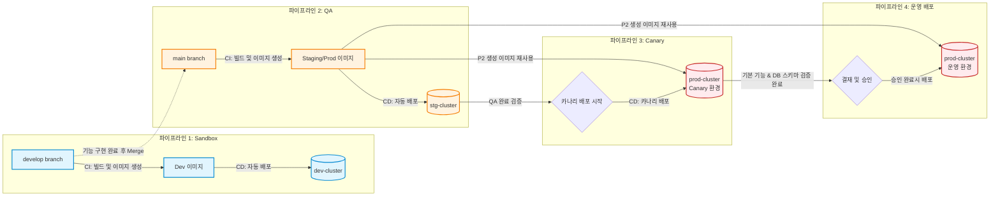

```mermaid
graph LR
    %% 스타일 정의
    classDef dev fill:#e1f5fe,stroke:#0288d1,stroke-width:2px;
    classDef stg fill:#fff3e0,stroke:#f57c00,stroke-width:2px;
    classDef prod fill:#ffebee,stroke:#c62828,stroke-width:2px;
    classDef pipeline fill:#f5f5f5,stroke:#616161,stroke-width:2px,stroke-dasharray: 5 5;

    %% 파이프라인 1: Sandbox
    subgraph P1 [파이프라인 1: Sandbox]
        B_dev[develop branch] -->|CI: 빌드 및 이미지 생성| D_img[Dev 이미지]
        D_img -->|CD: 자동 배포| Env_dev[(dev-cluster)]
    end
    style P1 pipeline
    class B_dev,D_img,Env_dev dev;

    %% 파이프라인 2: QA/Staging
    subgraph P2 [파이프라인 2: QA]
        B_main[main branch] -->|CI: 빌드 및 이미지 생성| S_img[Staging/Prod 이미지]
        S_img -->|CD: 자동 배포| Env_stg[(stg-cluster)]
    end
    style P2 pipeline
    class B_main,S_img,Env_stg stg;

    %% 파이프라인 3: Canary Test
    subgraph P3 [파이프라인 3: Canary]
        Env_stg -->|QA 완료 검증| P3_start{카나리 배포 시작}
        S_img -->|P2 생성 이미지 재사용| Env_canary[(prod-cluster <br> Canary 환경)]
        P3_start -->|CD: 카나리 배포| Env_canary
    end
    style P3 pipeline
    class Env_canary prod;

    %% 파이프라인 4: Production Release
    subgraph P4 [파이프라인 4: 운영 배포]
        Env_canary -->|기본 기능 & DB 스키마 검증 완료| Appr{결재 및 승인}
        S_img -->|P2 생성 이미지 재사용| Env_prod[(prod-cluster <br> 운영 환경)]
        Appr -->|승인 완료시 배포| Env_prod
    end
    style P4 pipeline
    class Env_prod prod;

    %% 파이프라인 간 흐름 연결
    B_dev -.->|기능 구현 완료 후 Merge| B_main
```
