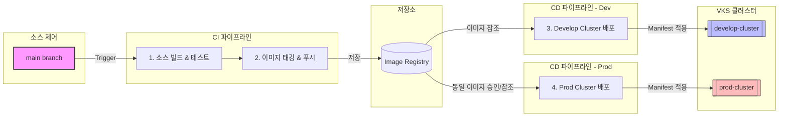

```mermaid
graph LR
    subgraph Source_Control [소스 제어]
        MainBranch[main branch]
    end

    subgraph CI_Pipeline [CI 파이프라인]
        Build[1. 소스 빌드 & 테스트]
        PushImg[2. 이미지 태깅 & 푸시]
    end

    subgraph Registry [저장소]
        ImgReg[(Image Registry)]
    end

    subgraph CD_Pipeline_Dev [CD 파이프라인 - Dev]
        DeployDev[3. Develop Cluster 배포]
    end

    subgraph CD_Pipeline_Prod [CD 파이프라인 - Prod]
        DeployProd[4. Prod Cluster 배포]
    end

    subgraph K8s_Clusters [VKS 클러스터]
        DevCluster[[develop-cluster]]
        ProdCluster[[prod-cluster]]
    end

    %% 흐름 연결
    MainBranch -->|Trigger| Build
    Build --> PushImg
    PushImg -->|저장| ImgReg
    
    %% Dev 배포 흐름
    ImgReg -->|이미지 참조| DeployDev
    DeployDev -->|Manifest 적용| DevCluster

    %% Prod 배포 흐름 (동일 이미지 사용)
    ImgReg -->|동일 이미지 승인/참조| DeployProd
    DeployProd -->|Manifest 적용| ProdCluster

    style MainBranch fill:#f9f,stroke:#333,stroke-width:2px
    style DevCluster fill:#bbf,stroke:#333,stroke-width:1px
    style ProdCluster fill:#fbb,stroke:#333,stroke-width:1px
```
