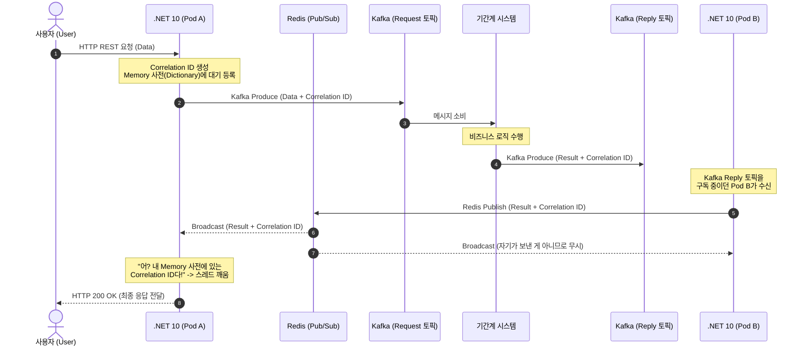

```mermaid
graph TD
    %% 외부 사용자 및 인그레스
    User((사용자)) -->|HTTP REST| Ingress[k8s Ingress / 인프라 LB]

    %% k8s Deployment 내부 (Replica 3)
    subgraph k8s_Deployment [MF Worker Deployment]
        direction LR
        PodA[Pod A <br/> 🟢 HTTP 수신처] 
        PodB[Pod B <br/> ⚡ Kafka 컨슘 주체]
        PodC[Pod C]
        Redis_PS[Redis: Pub/Sub Channel]
    end

    %% 인그레스 라우팅
    Ingress -->|랜덤 로드밸런싱| PodA

    %% 외부 및 내부 메시지 브로커
    subgraph Infrastructure [외부 인프라 레이어]
        Kafka_REQ[Kafka: Request Topic]
        Kafka_REP[Kafka: Reply Topic]
        Legacy[🏢 기간계 시스템]
    end

    %% 데이터 흐름 연결
    PodA -->|1. Produce| Kafka_REQ
    Kafka_REQ --> Legacy[🏢 기간계 시스템]
    Legacy -->|2. Produce| Kafka_REP
    
    %% Pod B가 컨슘하여 Redis로 전파
    Kafka_REP -->|3. Consume| PodB
    PodB -->|4. Pub| Redis_PS

    %% Redis가 모든 Pod로 브로드캐스트
    Redis_PS -.->|5. Sub Broadcast| PodA
    Redis_PS -.->|5. Sub Broadcast| PodB
    Redis_PS -.->|5. Sub Broadcast| PodC



    %% 최종 응답
    PodA -.->|6. HTTP Response| User

    %% 스타일링
    style k8s_Deployment fill:#2d3748,stroke:#4a5568,stroke-width:2px
    style Infrastructure fill:#2d3748,stroke:#4a5568,stroke-width:2px
    style Legacy fill:#3b82f6,stroke:#333,stroke-width:2px
```

# Kafka-Redis 기반 k8s 메시지 게이트웨이 아키텍처 요약

본 문서는 Kubernetes(k8s) 환경에서 `.NET 10` Web API를 사용해 메시지 게이트웨이를 구축하고, 기간계 시스템(`Kafka`) 및 분산 캐시(`Redis Pub/Sub`)를 연계하여 **고성능 무상태(Stateless) Request-Reply 패턴**을 구현한 아키텍처에 대한 요약입니다.

---

## 1. 아키텍처 구성 요소 (System Components)

| 컴포넌트명 | 역할 및 특징 |
| :--- | :--- |
| **사용자 (User)** | HTTP REST API를 통해 게이트웨이로 데이터를 전송하고 응답을 대기합니다. |
| **k8s Ingress / 인프라 LB** | 외부 유저 트래픽을 수신하여 3개 이상의 .NET 10 Pod로 랜덤하게 로드밸런싱합니다. |
| **.NET 10 Gateway (Replica 3+)** | 백그라운드 서비스(`BackgroundService`)와 메모리 맵(`ConcurrentDictionary`)을 이용해 비동기 요청-응답 매칭을 수행하는 웹 서버 레이어입니다. |
| **Kafka (기간계 브로커)** | 핵심 비즈니스 메시징 시스템입니다. 단일 요청 토픽(`Request`)과 단일 응답 토픽(`Reply`)을 운용합니다. |
| **Redis (Pub/Sub)** | 분산 배치된 Pod들 사이에서 응답 메시지를 초고속(In-Memory) 브로드캐스트하여 동기화하는 백플레인(Backplane) 역할을 합니다. |

---

## 2. 데이터 흐름 및 시퀀스 요약

전체 프로세스는 크게 **요청(Pub) ➔ 기간계 처리 ➔ 분산 응답 매칭(Sub)**의 3단계로 진행됩니다. (이해를 돕기 위해 *Pod A가 HTTP 요청을 받고, Kafka 응답은 Pod B가 컨슘한 상황*을 가정합니다.)

### 🔄 단계별 세부 흐름

#### [1단계] 요청 및 대기 (User ➔ Gateway)
1. **HTTP 요청 인입:** 사용자가 **Pod A**로 REST 요청을 보냅니다.
2. **상관관계 식별:** Pod A는 요청마다 고유한 `Correlation ID`를 생성하고, 내부 동시성 사전(`ConcurrentDictionary`)에 이 ID를 응답 대기 상태(`TaskCompletionSource`)로 등록한 뒤 스레드를 비동기 대기시킵니다.
3. **Kafka 발행:** Pod A는 비즈니스 데이터와 `Correlation ID`를 함께 담아 **Kafka Request 토픽**으로 발행(Produce)합니다.

#### [2단계] 기간계 처리 (Kafka ➔ Legacy)
4. **비즈니스 처리:** 기간계 시스템이 Kafka Request 토픽에서 메시지를 가져가 비즈니스 로직을 수행합니다.
5. **결과 반환:** 처리가 끝나면 결과 데이터에 최초의 `Correlation ID`를 헤더/바디에 그대로 유지한 채 **Kafka Reply 토픽**으로 발행합니다.

#### [3단계] Redis Pub/Sub을 통한 분산 응답 매칭
6. **Kafka 소비:** 단일 컨슈머 그룹으로 묶인 게이트웨이들 중, 파티션을 할당받은 **Pod B**가 Kafka Reply 토픽에서 응답을 컨슘합니다.
7. **Redis 전파:** Pod B는 이 응답이 자기가 들고 있는 대기 요청이 아닐 수 있으므로, 즉시 공용 **Redis Pub/Sub 채널로 브로드캐스트(Publish)**합니다.
8. **최종 매칭 및 응답:** 모든 Pod(A, B, C)가 Redis 채널을 상시 구독(`Sub`)하고 있으므로 응답을 동시에 수신합니다.
   * 최초 요청을 들고 있던 **Pod A**가 수신된 데이터에서 *"내 메모리에 대기 중인 Correlation ID다!"*를 감지하고 대기 스레드를 깨웁니다.
   * **Pod A**가 유저에게 HTTP Response(200 OK)를 최종 반환합니다. (매칭 정보가 없는 Pod B, C는 메시지를 무시합니다.)

---

## 3. 이 아키텍처의 핵심 장점 (Key Benefits)

> 💡 **완벽한 무상태(Stateless) 아키텍처 달성**
> 유저 요청을 받은 Pod가 아니더라도, 어떤 Pod든 Kafka 응답을 받아서 Redis로 뿌려주면 최초 요청을 받았던 Pod가 자가 진단으로 자기 응답을 찾아내 유저에게 돌려줄 수 있습니다.

* **Kafka 인프라 부담 최소화:** Pod가 스케일 아웃(3개 ➔ 10개)되어도 Kafka 쪽에 동적 토픽을 생성하거나 Consumer Group을 복잡하게 쪼갤 필요가 없습니다.
* **고성능 & 저지연 (Low Latency):** 인메모리 기반의 Redis Pub/Sub을 사용하므로 분산 Pod 간 메시지 전파 속도가 1ms 미만으로 매우 빠르며 서버 부하가 낮습니다.
* **유연한 확장성:** k8s Deployment의 Replica 수를 트래픽에 따라 자유롭게 Scale-in/out 할 수 있는 유연성을 제공합니다.

