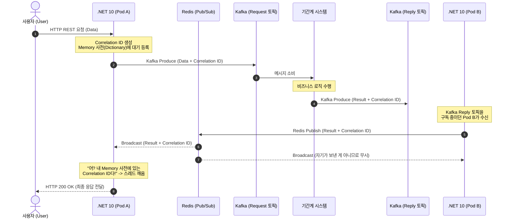

```mermaid
graph TD
    %% 외부 사용자 및 인그레스
    User((사용자)) -->|HTTP REST| Ingress[k8s Ingress / 인프라 LB]

    %% k8s Deployment 내부 (Replica 3)
    subgraph k8s_Deployment [MF Worker Deployment]
        direction LR
        PodA[Pod A <br/> 🟢 HTTP 수신처] 
        PodB[Pod B <br/> ⚡ Kafka 컨슘 주체]
        PodC[Pod C]
        Redis_PS[Redis: Pub/Sub Channel]
    end

    %% 인그레스 라우팅
    Ingress -->|랜덤 로드밸런싱| PodA

    %% 외부 및 내부 메시지 브로커
    subgraph Infrastructure [외부 인프라 레이어]
        Kafka_REQ[Kafka: Request Topic]
        Kafka_REP[Kafka: Reply Topic]
        Legacy[🏢 기간계 시스템]
    end

    %% 데이터 흐름 연결
    PodA -->|1. Produce| Kafka_REQ
    Kafka_REQ --> Legacy[🏢 기간계 시스템]
    Legacy -->|2. Produce| Kafka_REP
    
    %% Pod B가 컨슘하여 Redis로 전파
    Kafka_REP -->|3. Consume| PodB
    PodB -->|4. Pub| Redis_PS

    %% Redis가 모든 Pod로 브로드캐스트
    Redis_PS -.->|5. Sub Broadcast| PodA
    Redis_PS -.->|5. Sub Broadcast| PodB
    Redis_PS -.->|5. Sub Broadcast| PodC


    %% 최종 응답
    PodA -.->|6. HTTP Response| User

    %% 스타일링
    style k8s_Deployment fill:#2d3748,stroke:#4a5568,stroke-width:2px
    style Infrastructure fill:#2d3748,stroke:#4a5568,stroke-width:2px
    style Legacy fill:#3b82f6,stroke:#333,stroke-width:2px
```

```mermaid
sequenceDiagram
    autonumber
    actor User as 사용자 (User)
    participant PodA as .NET 10 (Pod A)
    participant Redis as Redis (Pub/Sub)
    participant KafkaReq as Kafka (Request 토픽)
    participant Legacy as 기간계 시스템
    participant KafkaRep as Kafka (Reply 토픽)
    participant PodB as .NET 10 (Pod B)

    %% 1단계: 요청 및 대기 등록
    User->>PodA: HTTP REST 요청 (Data)
    Note over PodA: Correlation ID 생성<br/>Memory 사전(Dictionary)에 대기 등록
    
    %% 2단계: 기간계로 Pub
    PodA->>KafkaReq: Kafka Produce (Data + Correlation ID)
    
    %% 3단계: 기간계 처리
    KafkaReq->>Legacy: 메시지 소비
    Note over Legacy: 비즈니스 로직 수행
    Legacy->>KafkaRep: Kafka Produce (Result + Correlation ID)
    
    %% 4단계: 분산 Pod의 컨슘 및 Redis 전파
    Note over PodB: Kafka Reply 토픽을<br/>구독 중이던 Pod B가 수신
    PodB->>Redis: Redis Publish (Result + Correlation ID)
    
    %% 5단계: Redis 브로드캐스트 및 매칭
    Redis-->>PodA: Broadcast (Result + Correlation ID)
    Redis-->>PodB: Broadcast (자기가 보낸 게 아니므로 무시)
    
    Note over PodA: "어? 내 Memory 사전에 있는<br/>Correlation ID다!" -> 스레드 깨움
    
    %% 6단계: 유저에게 응답
    PodA-->>User: HTTP 200 OK (최종 응답 전달)
```

